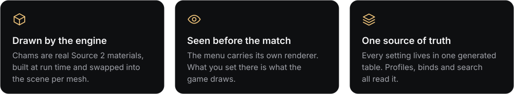

  

  

<a href="#about">About</a> &nbsp;·&nbsp;
<a href="#in-the-game">In the game</a> &nbsp;·&nbsp;
<a href="#custom-models">Custom models</a> &nbsp;·&nbsp;
<a href="#features">Features</a> &nbsp;·&nbsp;
<a href="#engineering">Engineering</a>

  

  

<h2>About</h2>

<b>Belenus</b> is a semi-rage Counter-Strike 2 internal written from scratch in C++20: one DLL that hooks the renderer and the scene system, draws its own interface over the game, and changes what the engine renders instead of painting on top of it. The menu above is not a mock-up. The agent stands in a real map with baked lighting, the arms hold the rifle with the game's own animations, and a material is shown the way the engine will draw it. The name is the Celtic god of light.

<h2>In the game</h2>

<kbd></kbd>

  

<h3>Player chams and ESP</h3>

The agent's own material, rebuilt at run time in your colour.

<ul>
<li><b>Five looks</b>: ghost, glow, solid, galaxy, metal</li>
<li><b>Through walls</b> in its own colour and opacity</li>
<li><b>ESP</b>: boxes, names, health, skeleton</li>
<li><b>Hit marks</b> on the point that was hit</li>
<li><b>Tracers</b> that leave the muzzle and travel</li>
</ul>

 

<h3>Hands and weapon</h3>

Three independent materials: the players, the weapon you hold, and your hands.

<ul>
<li><b>Own</b> look, colour, opacity, brightness, glow</li>
<li><b>Previewed in first person</b> on the real viewmodel</li>
<li><b>Inspect key</b> plays the inspect animation</li>
</ul>

 

<h2>Custom models</h2>

27 player models fitted to the game's skeleton and moved by the game's own animations. Five of them, turning on the menu's renderer:

<h2>Features</h2>

<h2>Engineering</h2>

  

<ul>
<li><b>A renderer inside the menu.</b> A dedicated D3D11 pipeline with 4x MSAA: maps exported from the game with their baked lightmaps, GPU skinning up to 160 bones, shadow maps with PCF, depth of field and a bloom pass.</li>
<li><b>Engine-level materials.</b> Written as KV3 text, compiled by the engine's own material system and swapped in through the scene system, per mesh and per owner, keeping the model's normal and occlusion maps.</li>
<li><b>Afterglow UI kit.</b> A component library on raw draw lists with its own layout engine, animation system, type scale and DPI handling. Nothing in it is a stock widget.</li>
<li><b>Asset pipeline.</b> Python tooling extracts models, textures, skeletons and animation clips from the game's packages and bakes them into compact binary formats.</li>
<li><b>UI harness.</b> The interface compiles and runs on its own, outside the game. One command renders any page at any resolution to a PNG; every menu image on this page was made that way.</li>
<li><b>Generated configuration.</b> Every setting is collected from the headers into one table at build time. Profiles, binds and migration between versions come from that single source.</li>
</ul>

<h2>Latest work</h2>

<ul>
<li><b>Chams</b> rebuilt on the agent's own material: players, weapon and hands are three materials that share nothing</li>
<li><b>Through walls</b> draws what cover hides flat, in its own colour and opacity</li>
<li><b>Menu scene</b> fills the whole window; weapon and hands are shown in first person</li>
<li><b>Hit marks</b> land on the point that was hit, and <b>tracers</b> start at the muzzle</li>
</ul>

 

Source is private. This repository is a showcase..

