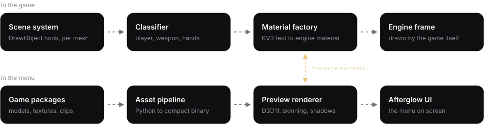

  

  

<kbd></kbd>

  

<h2>About</h2>

<b>Belenus</b> is a semi-rage Counter-Strike 2 internal written from scratch in C++20. It is one DLL that hooks the renderer and the scene system, draws its own interface over the game, and changes what the engine renders instead of painting on top of it. The name is the Celtic god of light.

The menu is not a list of checkboxes. The agent stands in a real map with baked lighting, the first-person arms hold the rifle with the game's own animations, and a material you pick is drawn the way the engine will draw it.

<table>
<tr>
<td width="33%" valign="top">
<b>Drawn by the engine</b>  
Chams are real Source 2 materials, built at run time and swapped into the scene per mesh. Nothing is painted over the finished frame.
</td>
<td width="33%" valign="top">
<b>Seen before the match</b>  
The menu carries its own renderer. Players, weapon and hands are previewed with the same numbers the game material is built from.
</td>
<td width="33%" valign="top">
<b>One source of truth</b>  
Every setting lives in one generated table. Profiles, binds, search and migration between versions all read it.
</td>
</tr>
</table>

<h2>In the game</h2>

<h3>Player chams and ESP</h3>

Real Source 2 materials, swapped in per mesh and per owner.

<ul>
<li><b>Five looks</b>: ghost, glow, solid, galaxy, metal</li>
<li><b>Through walls</b> in its own colour and opacity</li>
<li><b>ESP</b>: boxes, names, health, skeleton</li>
<li><b>Hit marks</b> on the point that was hit</li>
<li><b>Tracers</b> that leave the muzzle and travel</li>
</ul>

 

<h3>Hands and weapon</h3>

Three independent materials: the players, the weapon you hold, and your hands.

<ul>
<li><b>Own</b> look, colour, opacity, brightness, glow</li>
<li><b>Previewed in first person</b> on the real viewmodel</li>
<li><b>Inspect key</b> plays the inspect animation</li>
</ul>

 

<h2>Custom models</h2>

27 player models fitted to the game's skeleton and moved by the game's own animations. Five of them, turning on the menu's renderer:

<h2>Features</h2>

<h2>Engineering</h2>

  

<table>
<tr>
<td width="50%" valign="top">
<b>A renderer inside the menu</b>  
A dedicated D3D11 pipeline with 4x MSAA: maps exported from the game with their baked lightmaps (400k+ triangles), GPU skinning up to 160 bones, two 2048² shadow maps with PCF, depth of field, and a bloom pass for emissive materials.
</td>
<td width="50%" valign="top">
<b>Engine-level materials</b>  
Materials are written as KV3 text, compiled by the engine's own material system and swapped in through the scene system, per mesh and per owner. Emission follows the engine's units, so what a slider says is what the surface emits.
</td>
</tr>
<tr>
<td valign="top">
<b>Afterglow UI kit</b>  
A component library on raw draw lists: its own layout engine, animation system, type scale and DPI handling. A page is a short list of rows, and nothing in it is a stock widget.
</td>
<td valign="top">
<b>Asset pipeline</b>  
Python tooling extracts models, textures, skeletons and animation clips from the game's packages and bakes them into compact binary formats, streamed in on a worker thread.
</td>
</tr>
<tr>
<td valign="top">
<b>UI harness</b>  
The interface compiles and runs on its own, outside the game. One command renders any page at any resolution to a PNG, which is how the design is iterated and regression-checked.
</td>
<td valign="top">
<b>Generated configuration</b>  
Every setting is collected from the headers into one table at build time. Profiles, binds and migration between versions come from that single source.
</td>
</tr>
</table>

<h2>Latest work</h2>

<ul>
<li><b>Chams</b> rebuilt on engine materials: players, weapon and hands are three materials that share nothing</li>
<li><b>Through walls</b> draws what cover hides flat, in its own colour and opacity</li>
<li><b>Emission</b> is written in the engine's own units, so glow is predictable and capped</li>
<li><b>Menu scene</b> fills the whole window; weapon and hands are shown in first person</li>
<li><b>Hit marks</b> land on the point that was hit, and <b>tracers</b> start at the muzzle</li>
</ul>

 

Source is private. This repository is a showcase.

