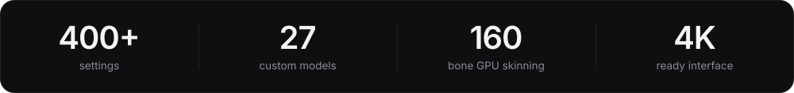
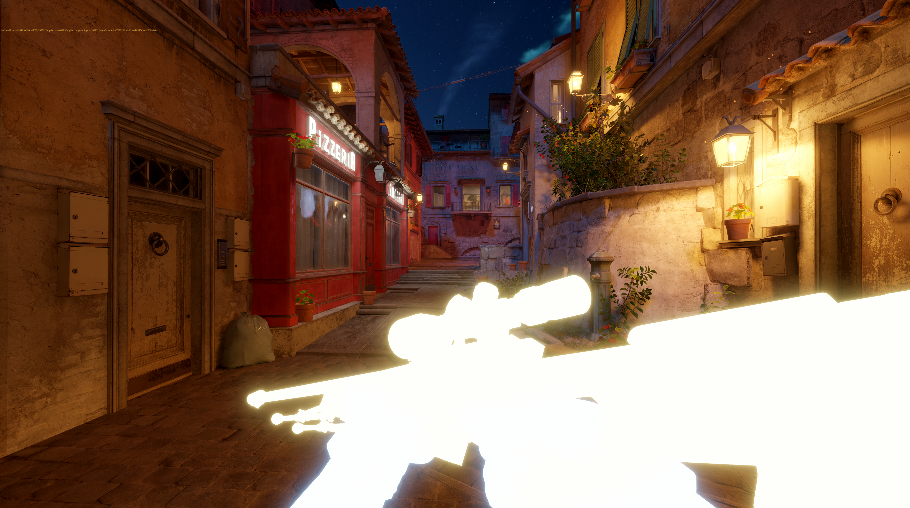
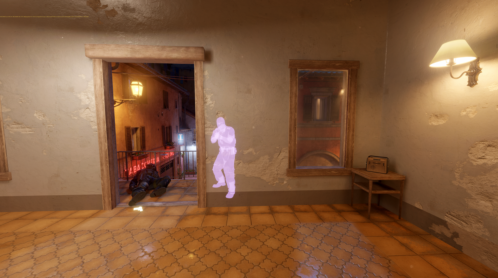
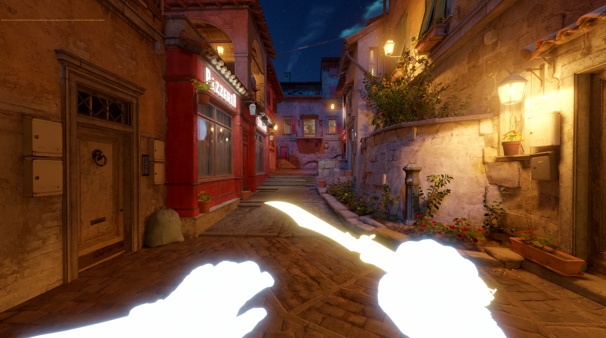
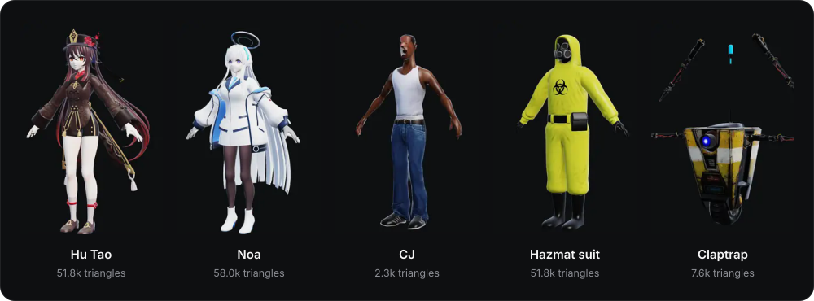
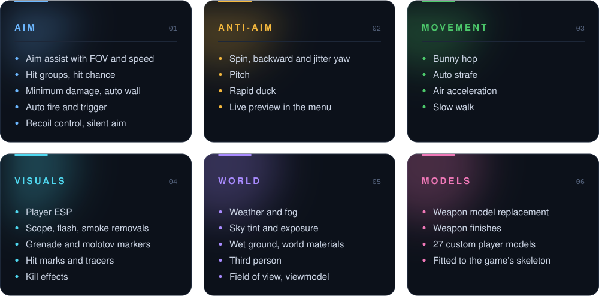

  

  

<a href="#about">About</a> &nbsp;·&nbsp;
<a href="#in-the-game">In the game</a> &nbsp;·&nbsp;
<a href="#custom-models">Custom models</a> &nbsp;·&nbsp;
<a href="#features">Features</a>

  

  

---

## About

**Belenus** — semi-rage CS2 internal, written in C++20.

Everything you see in the menu is live. Not a mockup.

---

## In the game

<kbd></kbd>

  

### Player chams & ESP

- ghost, glow, solid, galaxy, metal
- through walls
- box, name, health, skeleton
- hitmarkers + tracers

 

### Hands & weapon

Players, weapon and hands all use separate materials.  
You can preview them in first person from the menu.

 

---

## Custom models

27 models that use the game's own animations.

---

## Features

---

## Latest

- chams rewritten (players / hands / weapon are separate)
- through wall
- full menu scene with first person view
- hitmarkers + tracers

 

Source is private. This repo is just a showcase.

